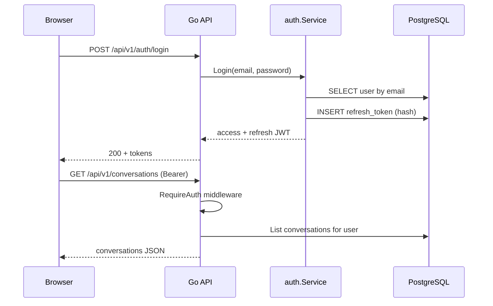
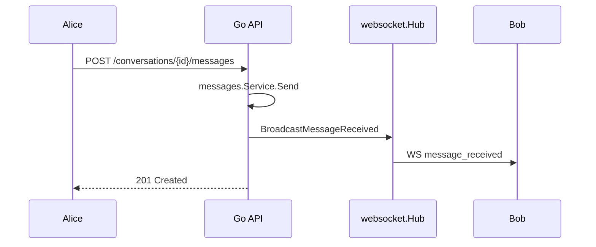

# Go Chat — Code Breakdown

A guided tour of this repository for developers coming from **Laravel** (like me) who want to understand how a Go backend could be structured.

---

## What this project is

A **1:1 real-time chat** app:


| Layer           | Technology                                       |
| --------------- | ------------------------------------------------ |
| API + WebSocket | Go 1.23, Chi router, pgx, JWT, Gorilla WebSocket |
| Frontend        | React, TypeScript, TanStack Query, Zustand       |
| Database        | PostgreSQL 16                                    |
| Infra           | Docker Compose                                   |


The backend follows a **layered, domain-oriented** layout, not really a full DDD/CQRS framework, but the same idea Laravel encourages when you split Controllers, Services, and Repositories instead of putting everything in one fat controller.

---

## Repository layout

```
go-chat/
├── backend/                 # Go API (this doc focuses here)
│   ├── cmd/
│   │   ├── server/          # Production binary entrypoint
│   │   └── simulator/       # Load-test traffic generator
│   ├── internal/            # Private application code (not importable by outsiders)
│   │   ├── auth/            # Login, register, JWT, refresh tokens
│   │   ├── users/
│   │   ├── conversations/
│   │   ├── messages/
│   │   ├── websocket/       # Hub, clients, tickets
│   │   ├── bootstrap/       # Run(), wiring, migrations, seed, lifecycle
│   │   ├── server/          # HTTP router
│   │   ├── middleware/
│   │   ├── config/
│   │   ├── database/
│   │   ├── apperr/          # Domain errors
│   │   ├── httpx/           # JSON encode/decode + request validation
│   │   └── requestctx/      # Per-request values (authenticated user ID)
│   ├── migrations/          # SQL migrations (goose)
│   ├── queries/             # SQL for sqlc (code generation)
│   └── go.mod               # Module path + dependencies
├── frontend/                # React SPA
├── loadtests/               # k6 + WebSocket bots
└── docker-compose.yml
```

### Laravel ↔ Go mental map


| Laravel                                  | This project                                    |
| ---------------------------------------- | ----------------------------------------------- |
| `routes/web.php`, `routes/api.php`       | `internal/server/router.go`                     |
| Controller                               | `Handler` (e.g. `auth/handler.go`)              |
| Service class / Action                   | `Service` (e.g. `auth/service.go`)              |
| Eloquent model + queries                 | `Repository` interface + `PostgresRepo`         |
| `app/Models/User.php`                    | `users/model.go` (plain struct, no ORM magic)   |
| Middleware                               | `internal/middleware/`                          |
| `.env` + `config/*.php`                  | `config.Load(getenv)` — injectable env reader   |
| `php artisan migrate`                    | `/app/server migrate` (goose)                   |
| `database/seeders`                       | `bootstrap/seed.go`                             |
| Service container / `AppServiceProvider` | `bootstrap/wire.go` (manual DI)                 |
| `public/index.php`                       | `cmd/server/main.go` → `bootstrap.Run()`        |
| Form Request validation                  | `httpx.DecodeValid` + `Valid()` on request DTOs |
| Laravel Echo / Pusher                    | In-process `websocket.Hub`                      |


**Important Go convention:** code under `internal/` can only be imported by this module. That is how Go enforces “application-private” packages, similar in spirit to keeping domain logic out of `vendor/`, but enforced by the compiler.

---

## How the program starts

This follows the pattern from [Mat Ryer’s “How I write HTTP services in Go”](https://grafana.com/blog/how-i-write-http-services-in-go-after-13-years/): ultra-thin `main`, a testable `run()` function, and injectable environment access.

### 1. `main` — thin entrypoint

```go
// backend/cmd/server/main.go
func main() {
    ctx := context.Background()
    if err := run(ctx, os.Getenv, os.Args[1:]); err != nil {
        fmt.Fprintf(os.Stderr, "%s\n", err)
        os.Exit(1)
    }
}

func run(ctx context.Context, getenv func(string) string, args []string) error {
    return bootstrap.Run(ctx, getenv, args)
}
```

`main` does almost nothing — it delegates to `run()`, which delegates to `bootstrap.Run()`. Tests can call the same `run()` (or `bootstrap.Run` directly) with a fake `getenv` and a cancellable `context`, without touching real environment variables.

### 2. `bootstrap.Run` — lifecycle

`Run(ctx, getenv, args)` loads config, sets up logging, then branches on CLI args:


| Command          | What it does                              |
| ---------------- | ----------------------------------------- |
| `server migrate` | Applies SQL migrations via goose          |
| `server seed`    | Creates demo users (alice/bob) if missing |
| *(no args)*      | Starts HTTP server + WebSocket hub        |


On normal HTTP startup (`serveHTTP` in `bootstrap/run.go`):

1. `Wire()` builds all dependencies (DB pool, services, handlers, router).
2. `net.Listen` binds to `PORT` (default `8080`; use `"0"` in tests for an ephemeral port).
3. `go deps.Hub.Run()` starts the WebSocket hub in a **background goroutine**.
4. `http.Server.Serve(listener)` handles requests.
5. Shutdown on `**ctx.Done()*`* (tests) or `**SIGINT`/`SIGTERM**` (production): hub shuts down, then HTTP server with a 10s timeout.

### 3. Integration test server — `StartHTTP` + `WaitForReady`

Tests don’t bypass the app — they exercise the same path as production:

```go
bootstrap.Run(ctx, getenv, []string{"migrate"})
srv, _ := bootstrap.StartHTTP(ctx, getenv)  // PORT=0 → random free port
// poll srv.BaseURL+"/ready" until 200, then hit the API
```

`WaitForReady` polls `/ready` — the same endpoint Docker and orchestrators use.

Docker still runs migrations + optional seed before the server via `backend/entrypoint.sh`.

---

## Dependency injection (`bootstrap/wire.go`)

Laravel’s container resolves `AuthController` and injects `AuthService` automatically. Go has **no built-in DI container** in this project — wiring is explicit:

```go
pool, _ := database.NewPool(ctx, cfg.DatabaseURL)

userRepo := users.NewPostgresRepo(pool)
refreshRepo := auth.NewPostgresRepo(pool)
convRepo := conversations.NewPostgresRepo(pool)
msgRepo := messages.NewPostgresRepo(pool)

tokenService := auth.NewTokenService(...)
authSvc := auth.NewService(userRepo, refreshRepo, tokenService)
// ... more services ...

hub := ws.NewHub(msgSvc, convRepo, convRepo.GetOtherParticipantID)
router := server.NewRouter(cfg, server.Handlers{...}, tokenService)
```

**Why this matters when learning Go:** you see every dependency in one file. No “where did this come from?” — it was passed in a constructor like `NewService(repo Repository)`.

Constructors are consistently named `New`, `NewService`, `NewHandler`, `NewPostgresRepo`.

---

## The three layers (per domain package)

Each feature (`auth`, `users`, `conversations`, `messages`) is split the same way:

```
handler.go    → HTTP: decode/validate JSON, read URL params, write JSON/status
service.go    → Business rules: authorization, orchestration, domain logic
postgres.go   → SQL: implements a Repository interface
model.go      → Plain structs (User, Message, Conversation)
repository.go → Interface only (for testing + swapping implementations)
```

**Validation is split on purpose:**


| Layer                   | Validates what                      | Laravel analogue        |
| ----------------------- | ----------------------------------- | ----------------------- |
| Request DTO (`Valid()`) | Format, required fields, lengths    | Form Request rules      |
| Service                 | Authorization, existence, conflicts | Policy + business rules |


### Request flow (REST)

```
HTTP Request
    → Chi router (server/router.go)
    → Middleware chain (logging, CORS, auth)
    → Handler method
    → Service method
    → Repository (Postgres)
    → PostgreSQL
```

### Example: send a message via REST

1. **Router** — `POST /api/v1/conversations/{id}/messages` inside auth-protected group.
2. **Middleware** — `RequireAuth` parses JWT, stores `userID` in `context`.
3. **Handler** (`messages/handler.go`):
  - Reads `userID` from context.
  - Parses conversation ID from URL.
  - `httpx.DecodeValid[sendRequest](r)` — decode JSON + run `sendRequest.Valid()` (content required, max 4000 chars).
  - On field errors → `httpx.WriteValidationError` with a `fields` map.
  - Calls `svc.Send(...)`.
  - Calls `hub.BroadcastMessageReceived(...)` so the other user gets it over WebSocket.
  - Returns `201` with message JSON.
4. **Service** (`messages/service.go`):
  - Re-checks content via shared `contentProblems()` (WebSocket also calls `Send` without going through the HTTP DTO).
  - Checks caller is a conversation participant (`conversations.IsParticipant`).
  - Delegates insert to repository.
5. **Repository** (`messages/postgres.go`):
  - Opens a transaction.
  - `INSERT INTO messages ...`
  - Updates `conversations.last_message_at` and preview.
  - Commits.

This is the same separation you would do in Laravel with a thin controller, a service, and Eloquent — except SQL is written by hand and errors are returned as `error` values, not thrown exceptions.

---

## HTTP routing (`internal/server/router.go`)

Uses **[Chi](https://github.com/go-chi/chi)** — a lightweight router, closer to Express/FastRoute than to Laravel’s full stack.

```go
r := chi.NewRouter()
r.Use(chimiddleware.Recoverer)   // panic → 500
r.Use(middleware.Logging)
r.Use(cors.Handler(...))

r.Route("/api/v1", func(r chi.Router) {
    r.Route("/auth", func(r chi.Router) { ... })
    r.Group(func(r chi.Router) {
        r.Use(authMW.RequireAuth)
        r.Get("/users/me", h.Users.Me)
        // ...
    })
})
```

**Route parameters:** `chi.URLParam(r, "id")` — like `$request->route('id')`.

**Sub-routers and groups:** `r.Route` and `r.Group` mirror Laravel’s `Route::prefix` + `middleware`.

Public vs protected routes are split by `r.Group` + `RequireAuth`, similar to `Route::middleware('auth:sanctum')`.

---

## Middleware


| Middleware                 | Role                      | Laravel analogue          |
| -------------------------- | ------------------------- | ------------------------- |
| `Recoverer`                | Catch panics              | Exception handler         |
| `RealIP` / `RequestID`     | Observability             | Trust proxies, request ID |
| `Logging`                  | Structured logs (zerolog) | `Log::info` per request   |
| `CORS`                     | Browser cross-origin      | `fruitcake/laravel-cors`  |
| `RequireAuth`              | JWT Bearer validation     | `auth:sanctum`            |
| Rate limiters on `/auth/`* | Brute-force protection    | `throttle`                |


### Auth middleware in detail

```go
func (m *AuthMiddleware) RequireAuth(next http.Handler) http.Handler {
    return http.HandlerFunc(func(w http.ResponseWriter, r *http.Request) {
        token := extractToken(r)  // Authorization: Bearer <jwt>
        userID, err := m.tokens.ParseAccessToken(token)
        ctx := requestctx.WithUserID(r.Context(), userID)
        next.ServeHTTP(w, r.WithContext(ctx))
    })
}
```

Go passes request-scoped data through `**context.Context**` — not globals, not `Auth::user()`. Handlers call `requestctx.UserIDFromContext(r.Context())`.

---

## Configuration (`internal/config/config.go`)

No `.env` parser in Go stdlib here — Docker injects env vars at runtime. Config is loaded through an **injectable `getenv` function**:

```go
// Production
cfg, err := config.Load(os.Getenv)

// Tests — parallel-safe, no t.SetEnv
cfg, err := config.Load(func(key string) string {
    switch key {
    case "APP_ENV": return "development"
    case "JWT_ACCESS_SECRET": return "dev-access-secret-change-in-production-32"
    default: return ""
    }
})
```

Production validation is strict:

- `JWT_ACCESS_SECRET` must be ≥ 32 chars.
- In `APP_ENV=production`, default dev secrets and DB credentials are rejected.

Laravel equivalent: `config/app.php` + `.env`, with `APP_ENV=production` checks in your own service provider. The injectable `getenv` is the Go version of passing a config array into a test instead of mutating `.env`.

---

## Database layer

### Migrations (goose)

SQL files in `backend/migrations/`:

- `000001_init.sql` — `users`, `conversations`, `conversation_participants`, `messages`, `refresh_tokens`
- `000002_direct_conversation_keys.sql` — ensures one direct chat per user pair

Run: `make migrate` or automatically on container start.

### Connection pool (pgx)

```go
pool, err := pgxpool.NewWithConfig(ctx, cfg)
```

`pgxpool.Pool` is a **connection pool** — like PDO persistent connections managed for you. Repositories receive `*pgxpool.Pool` and run queries.

There is **no ORM**. Queries are raw SQL in `postgres.go` files (and some in `queries/*.sql` for sqlc).

### sqlc (optional codegen)

`sqlc.yaml` points at `queries/` and `migrations/` to generate type-safe Go in `internal/database/sqlc`. The project also hand-writes SQL in repos — both patterns are common in Go shops.

### Schema highlights

- **Direct conversations:** `direct_conversation_keys (user_low, user_high)` with `user_low < user_high` prevents duplicate 1:1 threads when Alice starts a chat with Bob and Bob starts one with Alice.
- **Messages:** cursor pagination by `created_at DESC`.
- **Refresh tokens:** stored as SHA-256 hash, not plaintext — rotation on refresh.

---

## Authentication

### Access token (JWT)

- Short-lived (default 15m), HS256 signed.
- Claims include `sub` = user UUID.
- Sent as `Authorization: Bearer <token>` on REST calls.

### Refresh token

- Long-lived (default 7 days), random UUID string.
- Only a **hash** is stored in `refresh_tokens`.
- On refresh: old token revoked, new pair issued (rotation).
- On login: all previous refresh tokens for user are revoked (single session policy).

### WebSocket ticket (not JWT on the wire)

Browsers cannot easily attach `Authorization` headers to WebSocket handshakes in all setups, and long-lived WS connections should not depend on a 15-minute JWT.

Flow:

1. Client `POST /api/v1/ws/ticket` with JWT → receives one-time ticket (30s TTL).
2. Client connects `GET /ws/connect?ticket=<ticket>`.
3. Server redeems ticket (deleted immediately), upgrades to WebSocket, attaches `userID` to client.

`TicketStore` is in-memory (`map[string]ticketEntry` + mutex). Fine for single instance; multi-instance would need Redis or similar.

---

## WebSocket architecture

### Hub pattern (in-memory pub/sub)

```
                    ┌─────────────┐
  Client A ────────►│             │
                    │     Hub     │──── broadcast ────► Client B
  Client B ────────►│  (goroutine)│
                    └─────────────┘
                           │
                    register / unregister channels
```

`Hub.Run()` is a **single goroutine** with a `select` loop — classic Go concurrency pattern:

- `register` — add client, mark user online, notify others.
- `unregister` — remove client, mark offline.
- `broadcast` — push JSON envelope to one or all clients.

Each connected user has a `Client` with:

- `readPump()` — read WS frames, dispatch to `Hub.HandleIncoming`.
- `writePump()` — send from buffered channel, ping/pong keepalive.

This avoids locking the hub while doing I/O on every connection.

### Events


| Client → Server                | Server → Client                |
| ------------------------------ | ------------------------------ |
| `message_sent`                 | `message_received`             |
| `message_read`                 | `message_read`                 |
| `typing_start` / `typing_stop` | same (to other participant)    |
|                                | `user_online` / `user_offline` |
|                                | `connection` (on connect)      |
|                                | `error`                        |


Envelope shape:

```json
{
  "type": "message_received",
  "payload": { "message": { ... } },
  "timestamp": "2026-06-08T12:00:00.000000000Z"
}
```

Messages can be sent via **REST or WebSocket**; both go through `messages.Service` and then broadcast.

---

## Request validation (`internal/httpx/validator.go`)

HTTP request bodies use a **Validator interface** (inspired by Mat Ryer’s article):

```go
type Validator interface {
    Valid(ctx context.Context) map[string]string  // field → human-readable problem
}

req, problems, err := httpx.DecodeValid[registerRequest](r)
if err != nil {
    httpx.WriteError(w, apperr.ErrInvalidInput)  // malformed JSON
    return
}
if len(problems) > 0 {
    httpx.WriteValidationError(w, problems)       // field-level errors
    return
}
```

Example validation response:

```json
{
  "error": "invalid input",
  "fields": {
    "password": "must be at least 8 characters"
  }
}
```

DTOs with `Valid()` today: `registerRequest`, `loginRequest`, `refreshRequest` (auth), `createRequest` (conversations), `sendRequest` (messages).

---

## Error handling

### Domain errors (`apperr`)

```go
var (
    ErrNotFound     = errors.New("not found")
    ErrForbidden    = errors.New("forbidden")
    ErrUnauthorized = errors.New("unauthorized")
    // ...
)
```

Services return these as normal `error` values — **no exceptions**.

### HTTP mapping


| Helper                            | When                                  | Status                          |
| --------------------------------- | ------------------------------------- | ------------------------------- |
| `httpx.WriteValidationError`      | DTO `Valid()` returned field problems | 400 + `fields` map              |
| `httpx.WriteError`                | Domain errors (`apperr.`*)            | 400/401/403/404/409/500         |
| Malformed JSON from `DecodeValid` | `json.Decode` failed                  | 400 `{"error":"invalid input"}` |


```go
errors.Is(err, apperr.ErrForbidden) → 403
errors.Is(err, apperr.ErrNotFound)   → 404
default                               → 500 (opaque message)
```

Laravel would use Form Request validation for field errors and `abort(403)` for domain errors. Go keeps both paths in `httpx` helpers.

---

## Domain packages (quick reference)

### `auth`

- Register: bcrypt password, create user.
- Login: verify password, revoke old refresh tokens, issue pair.
- Refresh: rotate refresh token in a transaction.
- Logout: revoke refresh token hash.

### `users`

- Profile (`/users/me`), search by username (to start chats).

### `conversations`

- List for current user with last message preview, unread count, online flag from hub.
- Create direct chat (idempotent via `direct_conversation_keys`).

### `messages`

- Paginated history (`?cursor=&limit=`).
- Send, mark read (only recipient can mark others’ messages).

### `health` + `metrics`

- `/live`, `/ready`, `/health` for orchestration.
- `/metrics` — Prometheus (optional `METRICS_TOKEN`).

---

## Frontend integration (how the SPA uses the backend)

Not Go, but useful for end-to-end understanding:


| Concern                      | Where                                                                     |
| ---------------------------- | ------------------------------------------------------------------------- |
| REST client + JWT refresh    | `frontend/src/services/api.ts` (axios interceptors)                       |
| Auth state                   | Zustand `auth.store.ts`                                                   |
| Conversations/messages cache | TanStack Query                                                            |
| WebSocket                    | `hooks/useWebSocket.ts` — ticket → connect → update query cache on events |
| Presence                     | Zustand `presence.store.ts`                                               |


Login stores tokens; every API call attaches Bearer token; on `401` it tries refresh once, like Laravel Sanctum’s SPA flow.

---

## Testing

```bash
make test                                          # unit tests (excludes integration tag)
go test -tags=integration ./internal/integration/...  # full HTTP stack + real DB
```

Tests live next to code (`*_test.go`):


| Type        | Example                                        | What it tests                                                |
| ----------- | ---------------------------------------------- | ------------------------------------------------------------ |
| Unit        | `config/config_test.go`                        | `config.Load(fakeGetenv)` with `t.Parallel()`                |
| Unit        | `httpx/validator_test.go`                      | `DecodeValid`, `WriteValidationError`                        |
| Unit        | `auth/tokens_test.go`, `websocket/hub_test.go` | Isolated logic with mocks                                    |
| Integration | `integration/auth_flow_test.go`                | `bootstrap.Run` + `StartHTTP` → register → login → WS ticket |


**Integration tests follow Mat Ryer’s advice:** call the app the way users do — through `bootstrap.Run` and real HTTP, not by reaching into `Wire()` and handlers directly.

```go
ctx, cancel := context.WithCancel(context.Background())
getenv := integrationGetenv(databaseURL)  // fake env, PORT=0

bootstrap.Run(ctx, getenv, []string{"migrate"})
srv, _ := bootstrap.StartHTTP(ctx, getenv)
http.Post(srv.BaseURL+"/api/v1/auth/register", ...)
```

Cancel `ctx` in `t.Cleanup` to trigger graceful shutdown after the test.

Go tests are functions in the same package (or `_test` package for black-box). No PHPUnit XML — just `go test`.

---

## Other binaries


| Binary             | Purpose                                         |
| ------------------ | ----------------------------------------------- |
| `cmd/server`       | API + WebSocket                                 |
| `cmd/simulator`    | Synthetic users sending messages (load testing) |
| `loadtests/wsbots` | Many WebSocket clients                          |


---

## Key Go concepts for Laravel developers

### 1. Explicit error handling

```go
user, err := s.users.GetByEmail(ctx, email)
if err != nil {
    return nil, apperr.ErrInvalidCredentials
}
```

Every failure path is visible. No try/catch.

### 2. Interfaces for boundaries

```go
type Repository interface {
    GetByID(ctx context.Context, id uuid.UUID) (*User, error)
}
```

Small interfaces, often defined by the **consumer** package. Easy to mock in tests.

### 3. `context.Context`

First parameter on almost every service/repo method. Carries deadlines, cancellation, and request values (user ID). Always pass `r.Context()` from HTTP handlers.

### 4. Goroutines and channels

WebSocket hub = one goroutine + channels. `go hub.Run()`, `go client.readPump()`. Laravel queues/Horizon solve a different problem; here concurrency is in-process.

### 5. No classes — structs + methods

```go
type Service struct { users Repository }
func (s *Service) Login(ctx context.Context, input LoginInput) (*LoginOutput, error)
```

`Service` is a struct; `Login` is a method on it. Receivers are like `$this` in PHP.

### 6. Packages = folders

`import "github.com/luizf/go-chat/backend/internal/auth"` — import path matches module name in `go.mod`. One package per directory (usually).

### 7. Composition over inheritance

No `extends Controller`. Embed structs if you need reuse: `type Handler struct { svc *Service }`.

---

## End-to-end diagrams

### Login + load conversations




### Real-time message




---

## Suggested learning path (using this repo)

1. **Read in order:** `cmd/server/main.go` → `bootstrap/run.go` → `bootstrap/wire.go` → `server/router.go`.
2. **Pick one vertical slice:** trace `POST /auth/login` through handler (`DecodeValid`) → service → postgres.
3. **Compare to Laravel:** write down what would be a Controller, FormRequest, Policy, and Eloquent call for the same flow.
4. **Run locally:** `docker compose up --build`, hit endpoints with curl or the UI.
5. **Change something small:** e.g. add a validation rule to `registerRequest.Valid()` or a new field on `GET /users/me`.
6. **Read tests:** `config/config_test.go` (injectable env), `httpx/validator_test.go`, `integration/auth_flow_test.go`.
7. **Study concurrency:** `websocket/hub.go` — the `select` loop is a pattern you will see everywhere in Go.
8. **Read externally:** [Mat Ryer’s HTTP services post](https://grafana.com/blog/how-i-write-http-services-in-go-after-13-years/) — this repo implements most of it.

---

## Commands cheat sheet


| Task               | Command                                                                       |
| ------------------ | ----------------------------------------------------------------------------- |
| Start stack        | `docker compose up --build`                                                   |
| Dev hot reload     | `docker compose -f docker-compose.yml -f docker-compose.dev.yml up --build`   |
| Migrations         | `make migrate`                                                                |
| Seed demo users    | `make seed`                                                                   |
| Backend unit tests | `make test`                                                                   |
| Integration tests  | `go test -tags=integration ./internal/integration/...` (needs `DATABASE_URL`) |
| API base           | `http://localhost:8080/api/v1`                                                |
| WebSocket          | `ws://localhost:8080/ws/connect?ticket=...`                                   |


---

## HTTP service conventions (Mat Ryer alignment)

This repo intentionally follows common Go HTTP service patterns:


| Pattern                                   | Where in this repo                                    |
| ----------------------------------------- | ----------------------------------------------------- |
| Thin `main` + `run()` returning `error`   | `cmd/server/main.go`                                  |
| Injectable `getenv` for testable config   | `config.Load(getenv)`                                 |
| Single routes file                        | `internal/server/router.go`                           |
| Explicit dependency wiring                | `internal/bootstrap/wire.go`                          |
| Shared encode/decode helpers              | `internal/httpx/response.go`                          |
| `Validator` on request DTOs               | `internal/httpx/validator.go` + handler request types |
| Middleware as `http.Handler` wrappers     | `internal/middleware/`                                |
| Graceful shutdown via `context` + signals | `internal/bootstrap/run.go`                           |
| Readiness endpoint for tests and ops      | `/ready`, `bootstrap/WaitForReady`                    |
| End-to-end integration tests              | `internal/integration/` via `bootstrap.Run`           |


**Still different from the article (by choice):** handlers are struct methods (`auth.Handler`) rather than standalone `handleLogin(svc) http.Handler` functions, and there is a Service/Repository layer because this is a multi-domain app, not a single-file API.

---

## File index (backend)


| Path                          | Responsibility                           |
| ----------------------------- | ---------------------------------------- |
| `cmd/server/main.go`          | Thin entry → `bootstrap.Run`             |
| `internal/bootstrap/run.go`   | `Run`, `StartHTTP`, server lifecycle     |
| `internal/bootstrap/ready.go` | `WaitForReady` polling helper            |
| `internal/bootstrap/wire.go`  | Dependency graph                         |
| `internal/server/router.go`   | All HTTP routes                          |
| `internal/middleware/auth.go` | JWT gate                                 |
| `internal/config/config.go`   | `Load(getenv)` configuration             |
| `internal/auth/`*             | Authentication domain                    |
| `internal/users/*`            | User profiles                            |
| `internal/conversations/*`    | Chat threads                             |
| `internal/messages/*`         | Messages + read receipts + `validate.go` |
| `internal/websocket/*`        | Real-time hub                            |
| `internal/apperr/errors.go`   | Sentinel errors                          |
| `internal/httpx/response.go`  | JSON HTTP responses                      |
| `internal/httpx/validator.go` | `DecodeValid`, `WriteValidationError`    |
| `internal/integration/*`      | Full-stack HTTP tests                    |
| `migrations/*.sql`            | Schema                                   |


---

*Generated as a learning guide for this repository. For API contracts and env vars, see [README.md](README.md) and [.env.example](.env.example).*